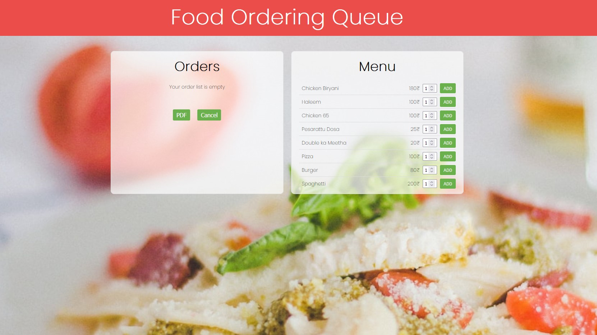

<div align="center" markdown="1">
  
[](https://www.gnu.org/licenses/gpl-3.0)
[](https://github.com/bharathajjarapu/Bloatbuster)
</div>
<p align="center">
<a href="https://github.com/bharathajjarapu/QueueOrder">
   <h1 align="center">Queue Order</h1></a>
</p>
<p align="center">
  This is a Food Ordering Website Project .
</p>

## Summary

This website uses a Queue data structure to manage food orders using a linked list approach. It allows users to enqueue (add) orders, dequeue (remove) orders, and print order receipts. The website is built using HTML, CSS, and JavaScript, providing an interactive and user-friendly experience for customers.

Website Link - [Here](https://bharathajjarapu.github.io/QueueOrder)



## Features

- **Enqueue Order**: Customers can add new food orders to the queue, which will be processed in a first-in, first-out (FIFO) manner.
- **Dequeue Order**: Once an order is prepared, it can be dequeued (removed) from the queue, ensuring that orders are served in the correct order.
- **Print Receipt**: After an order is dequeued, customers can print a receipt displaying the details of their order.
- **Interactive UI**: The website provides an intuitive and responsive user interface, allowing customers to easily navigate and place orders.

## Technologies Used

- HTML5
- CSS3
- JavaScript
- Queue Data Structure
- Linked List Implementation

## Getting Started

To run the project locally, follow these steps:

1. Clone the repository:

```bash
git clone https://github.com/bharathajjarapu/QueueOrder.git
```

2. Navigate to the project directory:

```bash
cd QueueOrder
```

3. Open the `index.html` file in your preferred web browser.

## Contributing

Contributions are welcome! If you have any ideas, bug reports, or feature requests, please open an issue or submit a pull request.

## License

This project is licensed under the [MIT License](LICENSE).

## Acknowledgments

- The project was inspired by the need for efficient order management in the food industry.
- Special thanks to the open-source community for providing valuable resources and libraries.

Experience the convenience of ordering food with the Queue Order website, where your orders are handled seamlessly using the power of data structures! 🍕🍔🍟